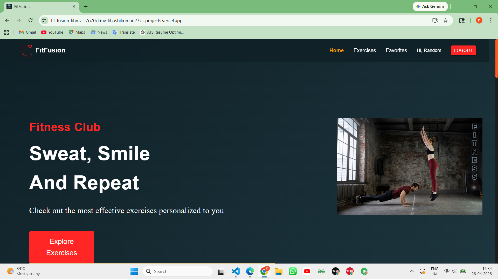
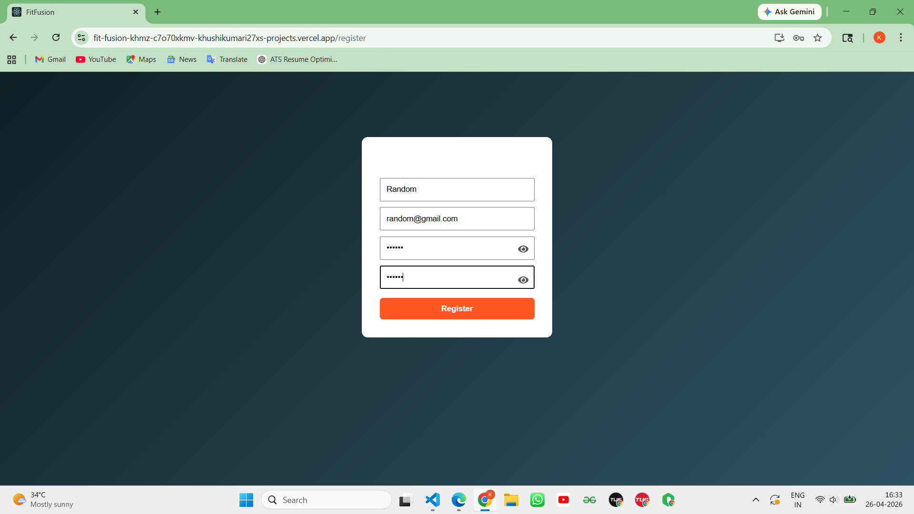
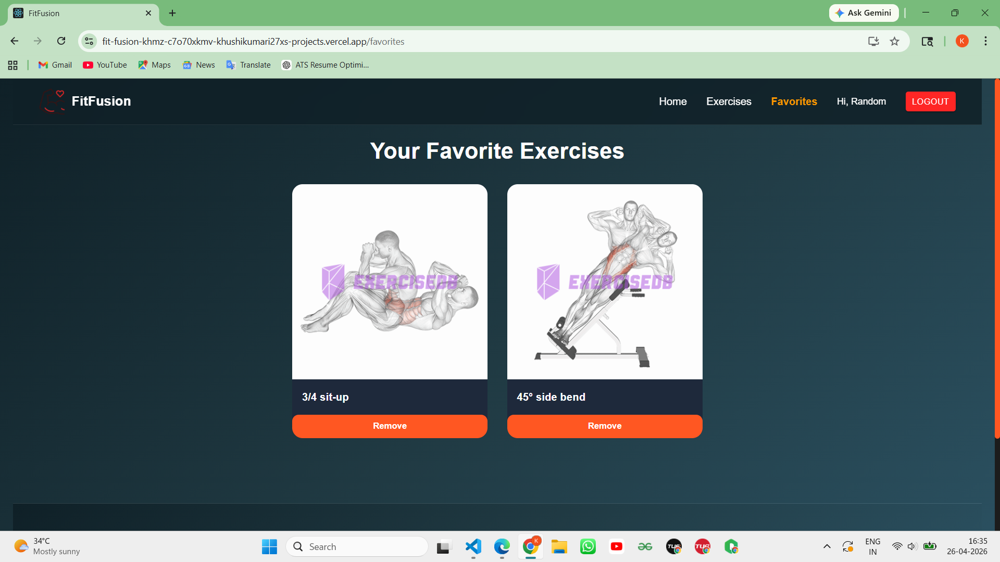
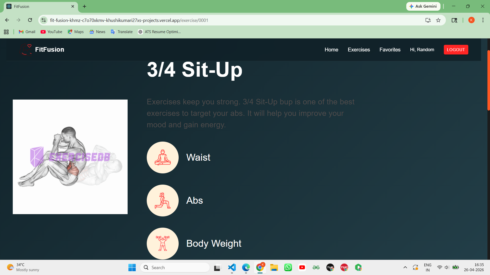

#  FitFusion – Full Stack Fitness Web App

FitFusion is a full-stack fitness web application that allows users to explore exercises, save favorites, and manage their fitness journey through a modern and responsive interface.

---

##  Live Demo

- 🔗 Frontend: https://fit-fusion-khmz.vercel.app  
- 🔗 Backend: https://fitfusion-backend-f8j6.onrender.com  

---

##  Tech Stack

### Frontend
- React.js
- Material UI
- Axios
- React Router
- React Hot Toast

### Backend
- Node.js
- Express.js
- MongoDB Atlas
- JWT Authentication
- Mongoose

### Deployment
- Frontend → Vercel  
- Backend → Render  

---
##  Screenshots

###  Home Page

###  Register

###  Exercise Page

###  Favorites

###  About

##  Features

-  User Authentication (Register & Login)
-  Add / Remove Favorite Exercises
-  Browse Exercises
-  Protected Routes
-  Fast & Responsive UI
-  Full-stack Deployment

---

##  Environment Variables

### Frontend (.env)
### Backend (.env)

---

##  API Endpoints

### Auth
- POST `/api/auth/register`
- POST `/api/auth/login`

### Favorites
- GET `/api/favorites`
- POST `/api/favorites`
- DELETE `/api/favorites/:id`

---

##  Author

**Khushi Kumari**

---

##  Support

If you like this project, consider giving it a ⭐ on GitHub!

