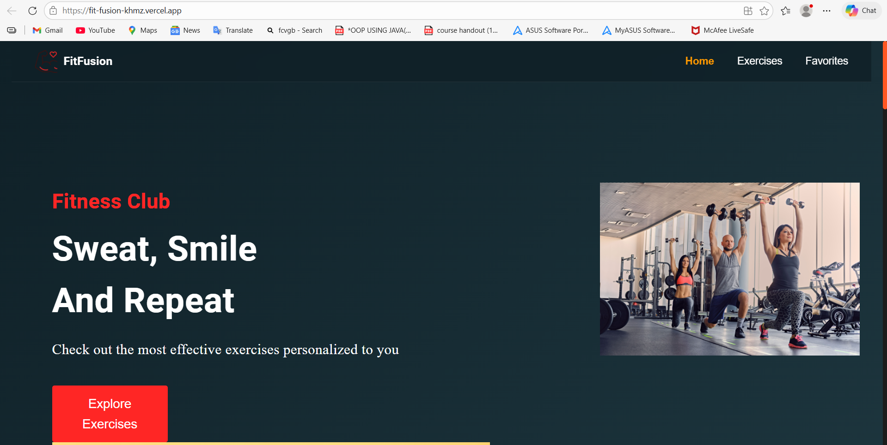
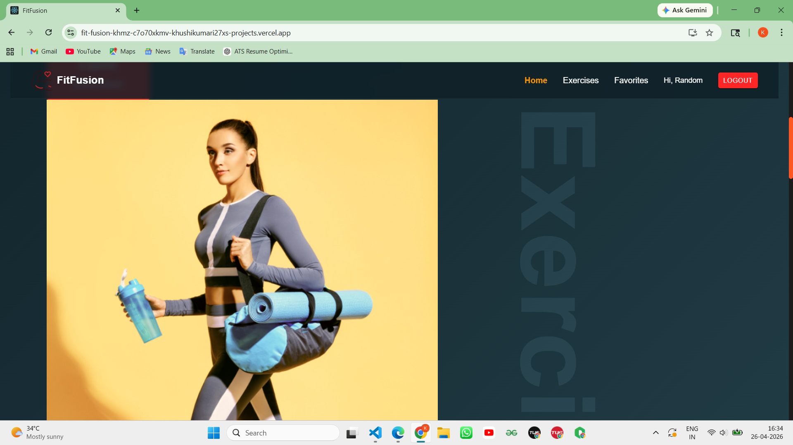
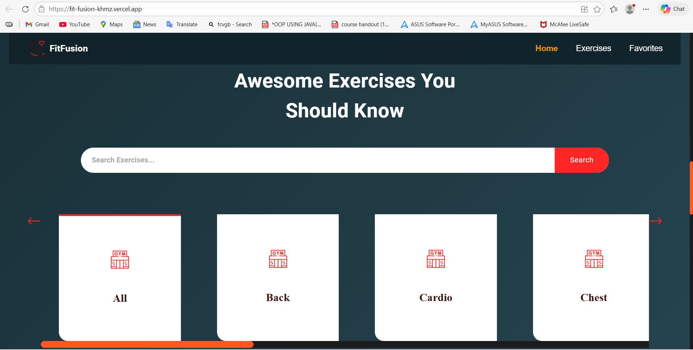
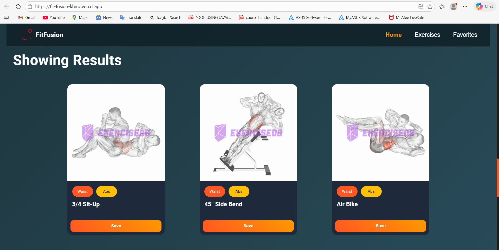
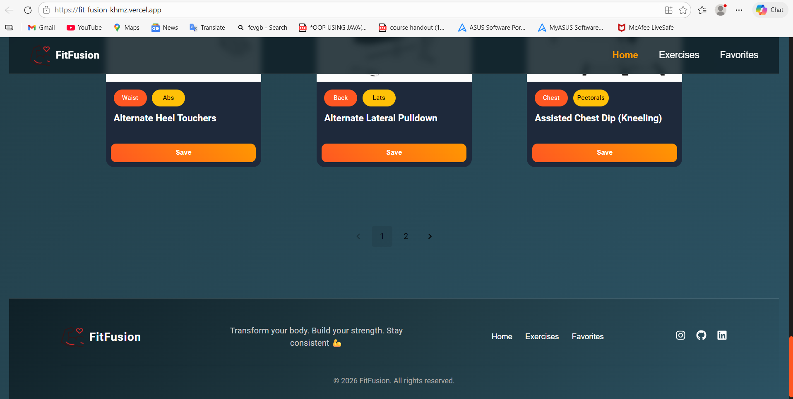

#  FitFusion

 **Live Demo:** https://fit-fusion-khmz.vercel.app  
 **GitHub Repo:** https://github.com/KhushiKumari27X/FitFusion  

---

##  Overview
FitFusion is a modern **React-based fitness web application** that helps users explore exercises, view detailed workout instructions, and manage their fitness journey with an intuitive and responsive UI.

---

##  Features
-  Search exercises by name
-  Browse exercises by body part
-  Detailed exercise information
-  Add exercises to favorites
-  Watch related exercise videos
-  Fully responsive design

---

##  Tech Stack
- **Frontend:** React.js  
- **Styling:** CSS  
- **Deployment:** Vercel  
- **API:** ExerciseDB API  

---

##  Screenshots

###  Home Page

###  Exercises Page



###  Favorites



---

##  Installation & Setup

1. Clone the repository:
```bash
git clone https://github.com/KhushiKumari27X/FitFusion.git
